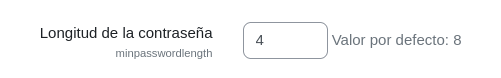
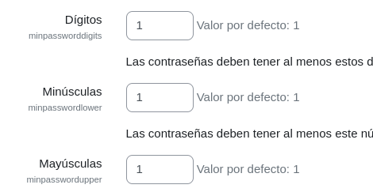

# UF4-Moodle
## Práctica de la UF4 
1. Inicia sessió com a administrador del teu Moodle i realitza les següents tasques prèvies d'administració.

a) Canvia la teva direcció de correu electrònic i també la teva contrasenya per una altra. Afegeix-te a més un avatar. Tot això es pot fer anant al teu perfil (opció que apareix sota el teu nom que es veu a la part superior dreta de la finestra del Moodle) i clicant sobre l'enllaç **Editar** (o també anant a l'opció **Preferències**, situada al mateix lloc).

b) Canvia el nom del teu lloc (tant llarg com curt) i fes que la pàgina principal no mostri res pels usuaris que no estiguin autentificats. Això es pot fer anant a l'opció **Administració del lloc** > **Primera plana** > **Paràmetres**

c) Comprova que la franja horària del teu lloc sigui la correcta. Això es pot fer anant a l'opció **Administració del lloc** > **Ubicació** > **Paràmetres**.

NOTA: Aquesta configuració és important, per exemple, per les hores límit d'entregues d'exercicis
d) Canvia l'idioma del teu lloc. Això es pot fer anant a l'opció **Administració del lloc** > **Idioma** > **Paràmetres** i tenint en compte tant el checkbox **Detecció automàtica de l'idioma** com el desplegable **Idioma per defecte**.

NOTA: Per disposar d'un determinat idioma, primer cal instal.lar-lo des de **Administració del lloc** > **Idioma** > **Paquets d'idioma**
e) Canvia la política de contrasenyes de manera que els usuaris que es creiïn tinguin una contrasenya de com a mínim 4 caràcters incloent-hi, majúscules, minúscules i xifres. Això es pot fer anant a l'opció **Administració del lloc** > **Seguretat** > **Normatives del lloc**.

2. Crea els següents cursos: un curs anomenat A (sense categoria) que estigui format per 3 temes i un altre anomenat B (també sense categoria) que estigui format per 5 temes. Tot això ho pots fer des de Administració del lloc->Gestiona cursos i categories o també des del quadre **Navegació** anant a **Cursos** > **Afegeix curs**

